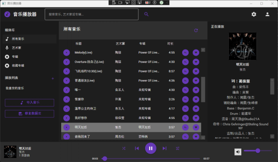
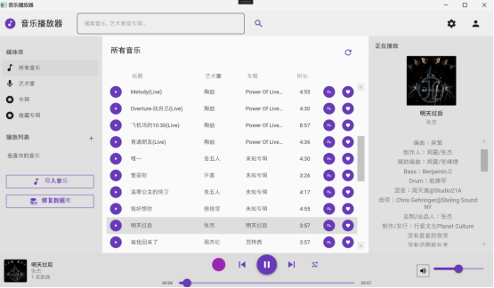
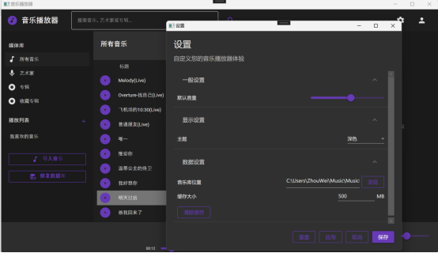
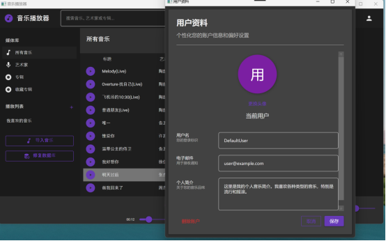

# MusicPlayerApp

简体中文 | [English](README.en.md)

一个基于 `C# + WPF + .NET Framework 4.8` 开发的本地音乐播放器客户端，适合在 Windows 桌面环境下管理和播放本地音频文件。

## 仓库信息

- GitHub：[`gggchang4/music_player_Csharp`](https://github.com/gggchang4/music_player_Csharp.git)
- 作者：`GGG Chang`
- GitHub 用户名：`gggchang4`

## 项目简介

这个项目主要面向本地音乐播放场景，包含音乐导入、播放控制、音乐库浏览、歌单管理、收藏、搜索、歌词显示、用户资料与设置等功能。整体采用 `MVVM` 结构组织，界面基于 `Material Design` 风格构建，数据层使用 `SQLite` 持久化。

## 功能特性

- 支持本地音频文件导入与播放
- 支持的音频格式包括 `mp3`、`wav`、`flac`、`ogg`、`m4a`、`wma`
- 提供“所有音乐 / 艺术家 / 专辑 / 收藏专辑”等视图
- 支持搜索歌曲、艺术家和专辑
- 支持歌曲收藏、专辑收藏
- 支持创建自定义播放列表，并将歌曲添加到歌单
- 默认包含“我喜欢的音乐”播放列表，并与收藏歌曲联动
- 提供基础播放控制：播放 / 暂停、上一曲、下一曲、进度拖动、音量、静音、随机播放、循环播放
- 支持本地歌词显示，优先读取歌曲同目录下的 `.lrc` 文件
- 提供用户资料页、主题设置、播放器设置、缓存清理等能力
- 提供均衡器设置窗口和预设保存能力

## 技术栈

- `C#`
- `WPF`
- `.NET Framework 4.8`
- `MVVM Light`
- `NAudio`
- `Entity Framework Core 2.2`
- `SQLite`
- `TagLibSharp`
- `MaterialDesignThemes`
- `Newtonsoft.Json`
- `NLog`

## 项目结构

```text
MusicPlayer/
├─ Audio/           音频相关处理
├─ Commands/        命令实现
├─ Controls/        自定义控件
├─ Converters/      值转换器
├─ Data/            数据库上下文与初始化
├─ Helpers/         辅助工具
├─ Models/          数据模型
├─ Services/        播放、媒体库、歌词、用户等服务
├─ UserControls/    通用用户控件
├─ ViewModels/      视图模型
├─ Views/           页面与窗口
└─ MusicPlayerApp.sln
```

## 运行环境

- Windows 10 / 11
- Visual Studio 2019 或 2022
- 已安装 `.NET desktop development` 工作负载
- 已安装 `.NET Framework 4.8 SDK / Targeting Pack`
- 支持 NuGet 包还原

## 快速开始

1. 克隆仓库

```bash
git clone https://github.com/gggchang4/music_player_Csharp.git
cd MusicPlayer
```

2. 用 Visual Studio 打开 `MusicPlayerApp.sln`
3. 执行 NuGet 包还原
4. 将 `MusicPlayerApp` 设为启动项目
5. 选择 `Debug` 或 `Release` 配置后运行

## 使用说明

- 首次启动时，程序会自动初始化本地数据库和默认数据
- 默认数据库位置：`%AppData%\MusicPlayerApp\musicplayer.db`
- 日志目录：`%AppData%\MusicPlayerApp\Logs`
- 封面缓存目录：`%AppData%\MusicPlayerApp\Covers`
- 本地缓存目录：`%LocalAppData%\MusicPlayerApp\Cache`
- 程序会自动创建默认用户 `DefaultUser`
- 默认会创建“我喜欢的音乐”播放列表
- 在左侧栏点击“导入音乐”即可导入本地音频文件
- 若歌曲目录下存在同名 `.lrc` 文件，播放器会优先加载本地歌词

## 项目截图

### 主界面



### 播放列表视图



### 设置视图



### 用户资料视图



## 当前说明

- 这是一个面向本地桌面使用场景的客户端项目
- 当前用户体系更偏向本地开发与演示用途，不适合作为生产级认证方案
- 歌词功能当前以本地 `.lrc` 文件加载为主，在线歌词接口仍可继续扩展
- 均衡器目前已具备界面与预设保存能力，真实音频 DSP 处理仍有继续完善空间

## 开发方向

- 支持按文件夹批量扫描和导入音乐库
- 优化均衡器的真实音频处理能力
- 增强歌词与元数据获取能力
- 完善异常处理、测试和发布流程

## 开源前检查清单

- 检查 `.gitignore`，避免把 `bin`、`obj`、本地数据库或 IDE 缓存误传到 GitHub
- 检查代码和日志中是否包含个人路径、账号信息或测试数据
- 确认 NuGet 依赖能够正常还原
- 确认首次启动流程可用，包括数据库初始化、默认用户创建和音乐导入
- 如需对外发布版本，建议创建 `Release` 并附带安装说明或压缩包

## 贡献

欢迎提交 `Issue` 和 `Pull Request`，一起完善这个项目。

## License

本项目采用 [MIT License](LICENSE) 开源。
